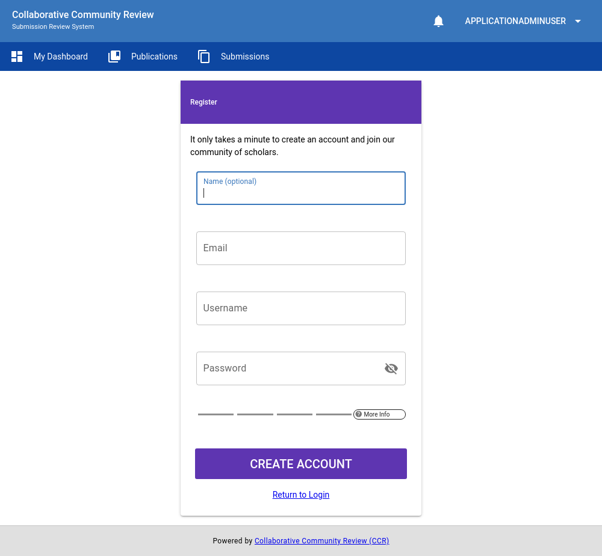
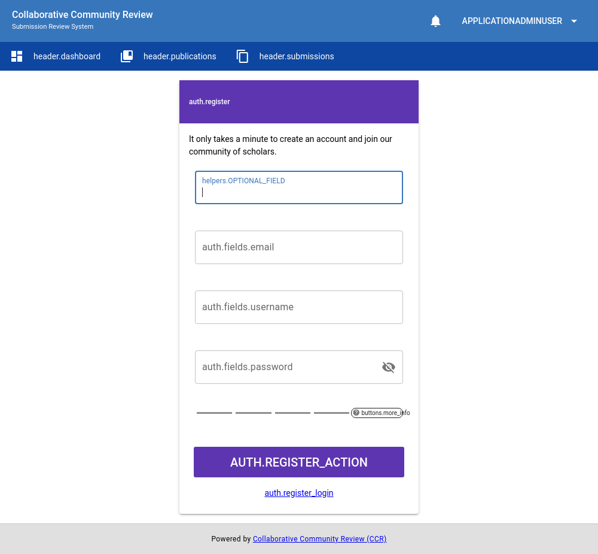

# Internationalization (i18n)

Application text that is present in Pilcrow is internationalized using the [vue-i18n package](https://vue-i18n.intlify.dev/).  All translatable strings in the application are located in
`/client/src/i18n`.

## Contributing Translations

If you are interested in contributing a translation, [please reach out to the team via GitHub](https://github.com/MESH-Research/CCR/discussions).

### en-US

If you have a GitHub account with writing access to [the GitHub repository](https://github.com/MESH-Research/CCR), you may update the American English i18n.js file directly by following these instructions:

1. Visit the translation file on GitHub located at [/client/src/i18n/en-US/index.js](https://github.com/MESH-Research/CCR/blob/master/client/src/i18n/en-US/index.js)
2. Click the "Edit this file" button in the upper-right of the page

      

3. Make your modifications directly to the translation text within the browser
4. Once finished, scroll down to the "Propose changes" section and replace the "Update index.js" placeholder in the text input with: `docs: Update en-US i18n.js text`

      

    - Optionally, add a description of your changes to the textarea beneath this text input
5. Click the "Propose changes" button
6. Click the "Create pull request" button
7. Done
    - The development team will coordinate with you further to merge your changes and officially update the application's text

If you need help, [please reach out to the team](https://github.com/MESH-Research/CCR/discussions) for assistance.

## Translation Tools

### Screenshots
The automated testing tools for the application generate two screenshots of each page.  The first displays the page in `en-US` and the second replaces   translatable strings with their key in the translation files to aid in locating the appropriate key to modify for a given string.

|  |  |
| :-----------------------------------: | :-----------------------------: |
| Translated Page            | Translation Keys for Page       |

You can download a zip file of these screenshots inside a [recent run of the integration test suite](https://github.com/MESH-Research/CCR/actions/workflows/test-e2e.yml). Click on a recent run and look for the `screenshots` artifact.  (Note: Screenshots are only saved for 14 days.)

Screenshots are also viewable on CCR's [cypress.io](https://dashboard.cypress.io/projects/omnycq/runs) profile. Click on a recent run and locate the "Copywriting Screenshots > Makes Screenshots" spec.  Click on that spec and you should find a button for screenshots in the flyout that opens.

### In-Browser Keys

If you are able to access/start a build of the application, you can also switch to the translation keys display mode by pressing `Ctrl+Shift+Alt+T`.  Pressing the key combination again will revert back to `en-US`.  (Note: This setting will not be saved between page loads, but you can invoke the key combination as often as you need.)
